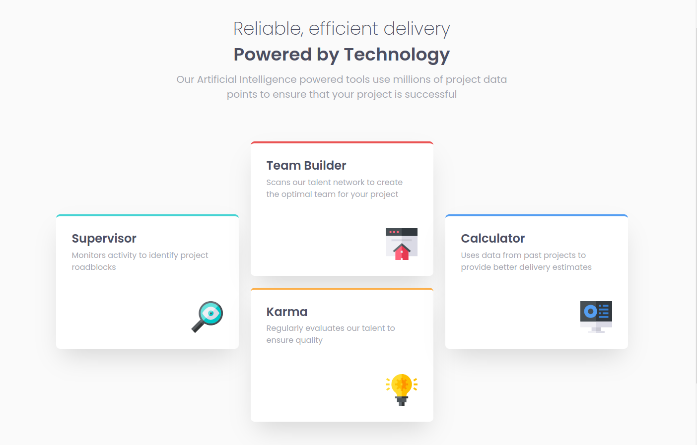
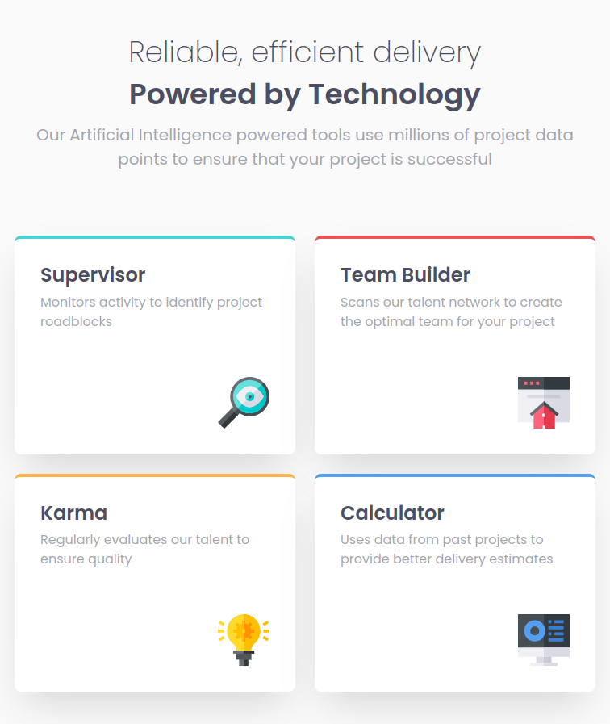
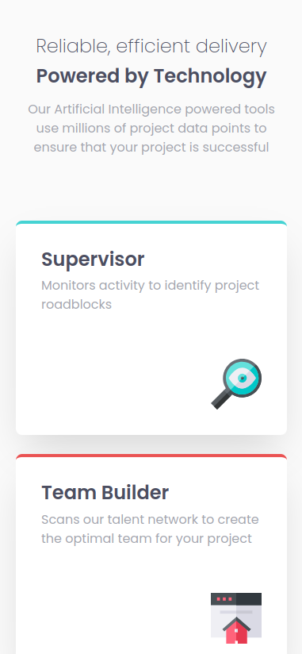

- Превью: https://kseylo.github.io/four-card-feature-section/
## Установка:

Установка зависимостей
```
pnpm install
```

Запуск
```
pnpm dev
```

## Скриншоты:
### ПК:

### Планшет:

### Телефон:

## Технологии которые использовал:
- HTML
- SASS

## Проблемы с которыми столкнулся:
- Возникла проблема с тем как расположить карточки при разрешении для персональных компьютеров
  решение:
```scss
@include desktop() {
	// 3 колонки
    grid-template-columns: repeat(3, 1fr);
    // 2 строчки  
    grid-template-rows: repeat(2, 1fr);
    // названия для более удобного расположения грид элементов  
    grid-template-areas:  
        'start mid1 end'  
        'start mid2 end';  
}

.supervisor {  
    border-top: $cyan 0.3rem solid;  
    @include desktop() {
	    // 1 колонна  
        grid-area: start;
        // Располагаем в центре по вертикали  
        align-self: center;  
    }  
}  
  
.team-builder {  
    border-top: $red 0.3rem solid;  
    @include desktop() {
	    // В 1 строке центре
        grid-area: mid1;  
    }  
}  
  
.karma {  
    border-top: $orange 0.3rem solid;  
    @include desktop() {
	    // Во 2 строке центре  
        grid-area: mid2;  
    }  
}  
  
.calculator {  
    border-top: $blue 0.3rem solid;  
    @include desktop() {
		// 3 колонна
        grid-area: end;  
        // Располагаем в центре по вертикали
        align-self: center;  
    }  
}
```